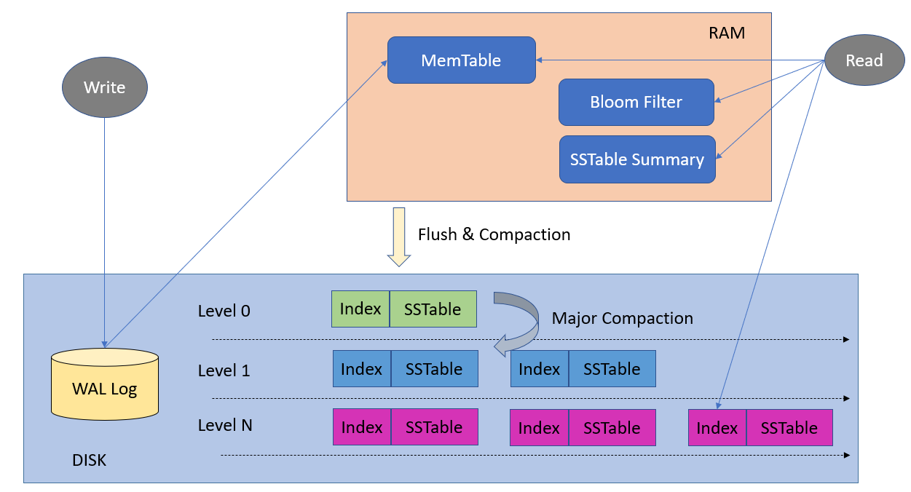
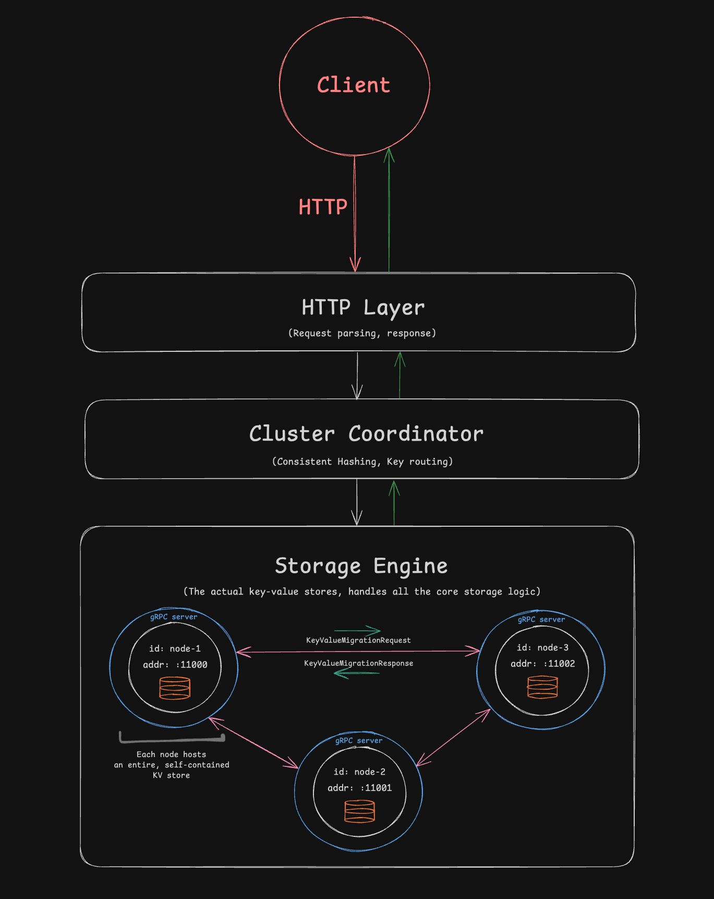

# Distributed Key-Value Store

This is a distributed LSM tree key-value store built with Go and gRPC, based on popular LSM tree databases like Apache Cassandra and ScyllaDB.

# How to Use

Make sure you have [gRPC](https://grpc.io/docs/languages/go/quickstart) set up beforehand. <br/>
Then, from the root directory, run `go run /cmd/main.go`. <br/></br>
This will run a cluster with 5 nodes. The number of nodes can be easily changed in `cmd/main.go`.<br/></br>
When running the cluster, an HTTP server will open on port `8080`. It can be used to get, set, or delete keys. The nodes are hosted on ports `11000`, `11001`, etc.

### Get, Set, Delete key-value pairs

In another tab, run:

```
curl -XPOST localhost:8080/key -d '{"song1": "ohms", "song2": "song for the deaf", "song3": "around the fur"}'

curl -XGET localhost:8080/key/song2
-> song for the deaf

curl -XDELETE localhost:8080/key/song3
```

This will result in the following print statements:

```
key = song1 added @ node addr = :11004
key = song2 added @ node addr = :11001
key = song3 added @ node addr = :11003
deleted song3 @ node addr = :11003
```

### Add additional nodes

To add additional nodes and actually see the data redistribution in action, we can first add 50 key-value pairs:

```
curl -XPOST localhost:8080/key -d '{
    "song1": "ohms", "song2": "song for the deaf", "song3": "around the fur",
    "song4": "pink maggit", "song5": "no one knows", "song6": "be quiet and drive",
    "song7": "up in arms", "song8": "straight jacket fitting", "song9": "better living through chemistry",
    "song10": "serve the servants", "song11": "everlong", "song12": "risk",
    "song13": "ceremony", "song14": "blue dress", "song15": "in my head",
    "song16": "selfless", "song17": "automatic stop", "song18": "7 words",
    "song19": "tempest", "song20": "pneuma", "song21": "minerva",
    "song22": "juicebox", "song23": "give it all", "song24": "bored",
    "song25": "slow animals", "song26": "carnavoyeur", "song27": "paper machete",
    "song28": "festival song", "song29": "anything", "song30": "lsf",
    "song31": "first it giveth", "song32": "song for the dead", "song33": "six shooter",
    "song34": "do it again", "song35": "gonna leave you", "song36": "go with the flow",
    "song37": "tomorrow", "song38": "another love song", "song39": "mosquito song",
    "song40": "976-evil", "song41": "headless", "song42": "radiant city",
    "song43": "hole in the earth", "song44": "urantia", "song45": "genesis",
    "song46": "headup", "song47": "this link is dead", "song48": "pompeji",
    "song49": "rosemary", "song50": "dai the flu"
}'
```

And then add an additional node, which automatically triggers data redistribution over the wire using gRPC:

```
curl -XPOST localhost:8080/add-node
```

This will result in all the operations being printed, including some lines that detail the data migration request.

### Removing nodes

```
curl -XPOST localhost:8080/remove-node/<node_port_number>
```

# Architecture



## Memtable

A memtable is an in-memory cache in which incoming writes are stored temporarily before they are flushed to disk (SSTable). In this sense, writes are batched, which minimizes the number of total disk writes, ultimately improving performance.

When flushing to the SSTable, we want the data to be sorted alphabetically by key. The solution is to implement the memtable as a red-black tree, which supports O(log(n)) data retrieval, insertion, and deletion.

## SSTable

An SSTable (Sorted String Table) is used for storing sorted key-value pairs such that retrieving data from it can be done efficently.

**Components:**

- Data file: sorted key-value pairs
- Sparse index file: stores a subset of the keys and their positions in the data file
- Bloom filter: space-efficient, probabilistic data structure that tests whether a key is a member of the SSTable

Each SSTable is represented by:

- <sst_num>.data
- <sst_num>.index
- <sst_num>.bloom

Upon key lookup, the database first checks the memtable. If it doesn't exist, we check the SSTables on disk:

- Using the bloom filter, check if a key may exist in the SSTable
- If so, use binary search + sparse indexes to find the max lower bound of the target key
- Scan every key-value pair starting from that bound position until either 1) the key is found or 2) we scan the last entry
- Repeat until target key is found

## Compaction

[Size-tiered compaction](https://cassandra.apache.org/doc/4.1/cassandra/operating/compaction/stcs.html) is used to improve writing performance.

## Write-Ahead-Log

Improves durability by serving as a crash recovery mechanism. For each operation, important information about the operation (what the operation is, what data was involved in the operation, etc.) is appended to a .log file. This can then be used to reconstruct the tree during crash recovery.

# Complete Tree

Combination of Memtables and SSTables, which form an in-memory and disk component, respectively, which prioritize write speeds

The following operations are supported:

- Get(key)
- Set(key, value)
- Delete(key)

# Distributed Architecture

Each node is a self-contained key-value store that contains a subset of the overall data, or in other words, a shard. When a key-value pair is inserted, it goes through a routing layer that utilizes [consistent hashing](https://en.wikipedia.org/wiki/Consistent_hashing) and is then routed to the correct node. [gRPC](https://grpc.io/) is used for inter-node communication, which is helpful for things like data rebalancing (happens when a node is added/removed). Each node is wrapped in a gRPC server to accept incoming requests, and gRPC clients are spawned only when data migration is needed.

A high-level overview of the overall design:

